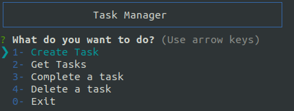
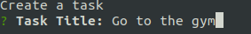
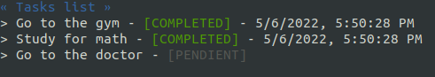
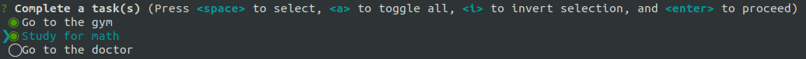
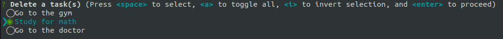
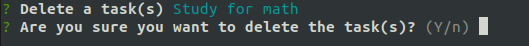

# Node - CLI Task

> This is the repository used during the development of the **'node-cli-task'**.

## DESCRIPTION

**'CLI Task'** is an application that allows the creation of a list of pending tasks and allowing that they can then be completed by automatically changing their status. It works through the terminal.

## DEVELOPMENT

All files in this repository were developed using _Node.js v14.19.1_, and the following external libraries has been used in the project:

    - inquirer (v8.2.4): A collection of common interactive command line user interfaces.
    - colors (v1.4.0): A library for immutable color conversion and manipulation with support for CSS color strings.
    - uuid (v8.3.2): To create a random UUID.

To run the project:

```
  cd node-cli-task

  npm install

  npm run
```

## HOW TO USE

- When the app start the CLI Task will show up:



- To create a new task just select the option _Create Task_, and a message will be prompted to _Enter Task title_:



- To view the Taks list select the option _Get Tasks_:



- To change the satus of a Task to COMPLETED select the option _Complete Task_ and you will be required to select the task(s) that you want to set status to completed:



- To delete a task select the option _Delete Task_ and you will be required to select the task(s) that you want to delete. Then you need to confirm:



